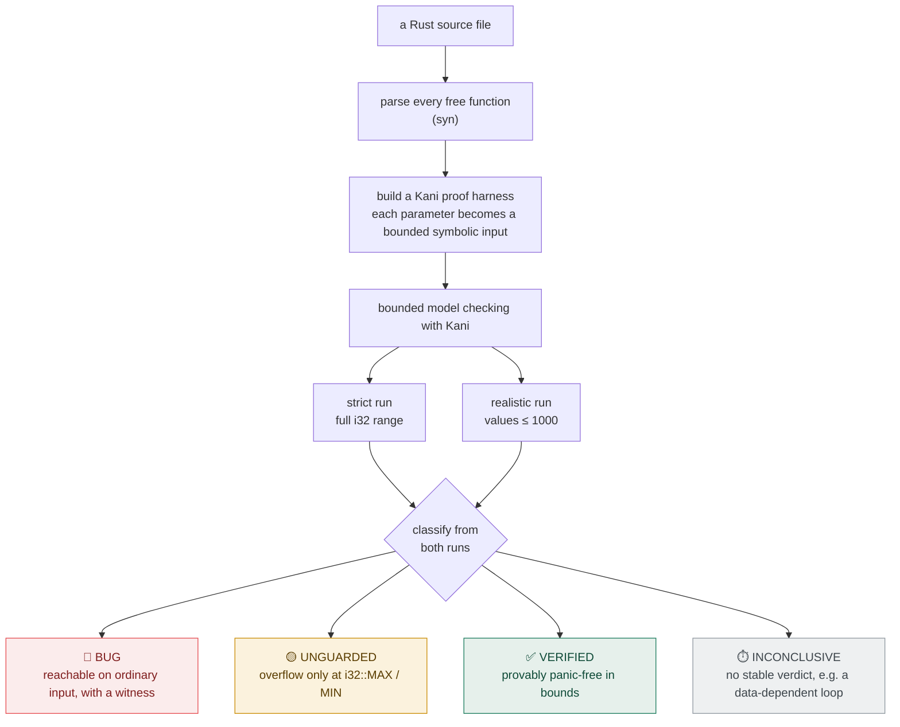
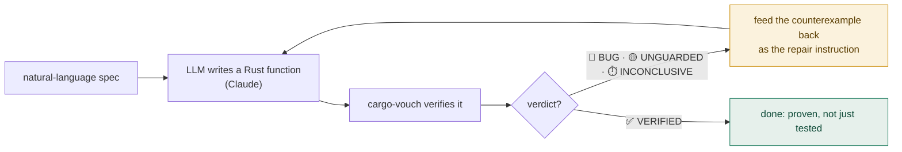

# cargo-vouch

**Prove a loop-light Rust function can't panic. Don't just test it.**

You write a lot of Rust with an LLM now, and `cargo test` only checks the cases you thought
to write. `cargo-vouch` generates a formal-verification harness for every function in a file,
runs bounded model checking (via [Kani](https://github.com/model-checking/kani)), and tells
you whether each one can panic or overflow on any input in bounds, not just a sample.

**Scope, up front.** It works when the bug is in the arithmetic, an index, or an `unwrap`:
divide-by-zero, an empty-collection `unwrap`, integer overflow, `parse().unwrap()`. On
functions with data-dependent or nested loops (parsers, string algorithms) the bounded model
checker runs out of unwinding depth and cargo-vouch returns INCONCLUSIVE. It never reports a
false pass, but it also gives no answer. A run on two random crates (`roman`, `levenshtein`)
came back INCONCLUSIVE on all 6 functions; see
[`REAL_WORLD_VALIDATION.md`](REAL_WORLD_VALIDATION.md). Point it at loop-light code, not at
your parser.


```console
$ cargo-vouch sum_vec.rs
🟡 UNGUARDED  `sum_vec` — safe on normal input, but overflows at i32::MAX/MIN:
     • attempt to add with overflow
     add a bounds guard or use checked_/saturating_ arithmetic.
```

That function was written by an AI that called it correct, and `cargo test` passes. Kani
proves it overflows on `[i32::MAX, 1]`. That is the difference between a test and a proof.


It also proves postconditions (`--prove 'result >= 0'`), gates a whole directory in parallel
(`cargo-vouch src/`, exit 1 on any bug), speaks `--json` for CI, and runs `--selftest` so it
never vouches for results it can't actually check.

Run on 14 functions of ordinary utility code, it found five reachable panics that `cargo test`
would ship (divide-by-zeros, empty-slice unwraps). See [`RESULTS.md`](RESULTS.md).


## What to point it at

The functions cargo-vouch is for. The bug is in the arithmetic, an index, or an `unwrap`, not
behind a loop:

```rust
fn page_count(total: i32, per_page: i32) -> i32 { (total + per_page - 1) / per_page } // 🔴 div-by-zero
fn mean(xs: &[i32]) -> i32 { xs.iter().sum::<i32>() / xs.len() as i32 }               // 🔴 empty-slice /0
fn charge(o: Order) -> u64 { o.qty * o.price }                                        // 🟡 overflow
fn parse_port(s: &str) -> u16 { s.parse().unwrap() }                                  // 🔴 unwrap on Err
fn clamp_page(p: i32, max: i32) -> i32 { p.clamp(0, max) }                            // ✅ proven safe
```

Not code like this. A data-dependent loop is out of reach for bounded model checking, and
cargo-vouch says so quickly (INCONCLUSIVE, with a note pointing you back here):

```rust
fn to_roman(mut n: i32) -> String { let mut s = String::new(); while n >= 1000 { n -= 1000; s.push('M'); } s }
```

## Why

- Tests are probabilistic. A proof isn't. Formal methods check every input in bounds.
- AI code has a blind spot for edge cases: empty vectors, integer overflow, `unwrap()` on
  `None`, divide-by-zero. cargo-vouch finds them before you ship.
- No annotations. You don't write specs or learn a verification language. Paste the function,
  get a verdict.

## Verdicts

| | Meaning |
|---|---|
| 🔴 **BUG** | Panic reachable on ordinary input, with the exact triggering value. Fix it. |
| 🟡 **UNGUARDED** | Only overflows at `i32::MAX/MIN`. Real, but adversarial. Add a guard. |
| ✅ **VERIFIED** | Provably panic-free within bounds (Vec ≤ 3, values ≤ 1000). |
| ⏱️ **INCONCLUSIVE** | Didn't finish in 120s/mode (too complex at the current bounds). Not a pass, not a bug. Exits `2`. |
| ⏭ **unsupported** | Uses a type outside v0 scope. Skipped cleanly, never a wrong answer. |

`cargo-vouch` exits non-zero on a BUG, so it drops into CI as a gate.

```console
$ cargo-vouch find_max.rs
🔴 BUG  `find_max` — panic reachable on ordinary input:
     • called `Option::unwrap()` on a `None` value
     reachable with input(s), in order: 0 (usize → empty vector)
```

## Batch mode (CI over a whole crate)

Pass more than one file, or a directory (recursed for `.rs`), and `cargo-vouch` verifies every
function in parallel, prints a summary table, and exits `1` if any function has a BUG.
`cargo-vouch src/` gates a whole crate in one command:

```console
$ cargo-vouch src/
cargo-vouch batch — 6 file(s), 3 workers, ≤120s/mode each

  dot_zip                🟡 UNGUARDED
  dot_index              🔴 BUG  ← 1 (usize → 1-element vector), -1, 0 (usize → empty vector)
  add_scalar             🟡 UNGUARDED
  slice_sum              🟡 UNGUARDED
  third                  🔴 BUG  ← 0 (usize → empty vector)
────
2 BUG · 3 UNGUARDED · 1 VERIFIED · 0 other
```

Set the gate strictness with `--fail-on`: `bug` (default, only reachable panics fail),
`unguarded` (also fail on extreme-input overflows), or `inconclusive` (also fail anything that
couldn't be proven). Exit 1 when the level is tripped.

Concurrency is capped low (about cores/4, max 3). Kani/CBMC is heavy and already
multi-threaded, so running too many at once starves each solver past its timeout and produces
false INCONCLUSIVE results. Low-but-parallel is both correct and about 2x faster than
sequential.

### GitHub Actions

Put the functions you want proven panic-free in a `verify/` directory and gate on them (this
repo ships a working copy in `.github/workflows/verify.yml`):

```yaml
- name: Install Kani
  run: cargo install --locked kani-verifier && cargo kani setup
- name: Install cargo-vouch
  run: cargo install cargo-vouch
- name: Prove verify/ is panic-free   # exits 1 on any BUG, fails the job
  run: cargo-vouch verify/*.rs
```

A Kani install takes minutes, so run this on a schedule or `workflow_dispatch` rather than on
every push, and keep `cargo test` and `clippy` on the hot path (see
`.github/workflows/ci.yml`).

### Machine-readable output

Add `--json` (single file or batch) for structured results you can post to a PR or gate on
programmatically:

```console
$ cargo-vouch --json src/*.rs | jq '.summary'
{ "bug": 1, "unguarded": 0, "verified": 1, "other": 0 }
```

Output is `{"results": [{"name", "verdict", "checks", "witness"}, …], "summary": {…}}`, one
entry per function (a file with many functions yields many results). The exit code is unchanged
(1 if any BUG).

## Prove properties, not just panic-freedom

Panic-freedom is the default. To prove a postcondition about the return value, pass `--prove`
with a boolean Rust expression over `result` (and the input names):

```console
$ cargo-vouch --prove 'result >= 0' abs_val.rs
✅ PROVEN  `abs_val` — result >= 0 holds for all inputs in bounds.

$ cargo-vouch --prove 'result.len() == xs.len()' double_all.rs
✅ PROVEN  `double_all` — result.len() == xs.len() holds for all inputs in bounds.

$ cargo-vouch --prove 'result > 0' abs_val.rs
🔴 VIOLATED  `abs_val` — result > 0 can be false (or the fn panics first):
     • vouch postcondition
     counterexample input(s), in order: 0
```

`PROVEN` exits `0` and `VIOLATED` exits `1`, so a postcondition is a CI gate too. The property
is checked for all inputs within the realistic bounds (values ≤ 1000, Vec ≤ 3).

## Install

Requires [Kani](https://model-checking.github.io/kani/install-guide.html) (the verification
engine):

```bash
cargo install --locked kani-verifier
cargo-kani setup
```

Then install cargo-vouch:

```bash
cargo install cargo-vouch
cargo-vouch path/to/function.rs
```

To build the latest from source instead:

```bash
git clone https://github.com/ss1738/cargo-vouch
cargo install --path cargo-vouch/cli
```

## How it works



1. **Parse** every free function with `syn`.
2. **Synthesise** a Kani proof harness. Each parameter becomes a symbolic input
   (`i32 → kani::any()`, `Vec<i32> →` a bounded symbolic vec, `Option<i32> → kani::any()`).
3. **Verify twice**, strict (all of `i32`) and realistic (values ≤ 1000). A panic that survives
   realistic bounds is a real BUG; one that only appears at `i32::MAX` is UNGUARDED. This
   dual-mode check is what stops false alarms on `a + b`.
4. **Report** the verdict and the concrete counterexample.

## Scope (v0)

**Supported:** safe Rust, every free function in a file (methods and `self` are skipped).
Parameters can be scalar ints (`i8..u64`, `bool`); `Vec<T>` and `Option<T>` for any supported
element or payload type (`Vec<i32>`, `Vec<Point>`, `Option<String>`, `Option<MyStruct>`, where
scalar elements use a fast path and others are synthesized); int slices (`&[int]`,
`&mut [int]`, `&Vec<int>`, with mutation through `&mut` verified too); `&str`/`String` (bound
as a symbolic ASCII string, length ≤ bound); tuples of scalar ints (`(i32, i32)`); same-file
structs (named, tuple, and unit, including newtypes like `struct UserId(u64)`, each field a
supported type, nested structs recurse, any unsupported field bounces cleanly); and same-file
enums (unit, tuple, and struct variants of supported types, where a nondeterministic selector
makes every variant get verified). Tuple returns work in both default and `--prove` mode
(`result.0`, `result.1`). The property checked is panic-freedom and integer overflow, bounded
(Vec ≤ 3, loops unwound ≤ 5). Idiomatic iterator chains verify fine
(`.iter().map().filter().collect()`, `.fold()`, `.scan()`, `.enumerate()`, `.max_by_key()` all
lower into the bounded model and don't path-explode), though heavy adapter chains are slow: an
`.iter().max().unwrap()` alone measured about 116s. Past 120s/mode the tool reports
INCONCLUSIVE instead of hanging.

**On strings.** `&str`/`String` catch the classic string panics (`.chars().next().unwrap()`,
`.parse().unwrap()` on empty or malformed input), with a witness, at default settings (about 30
to 40s). Strings are roughly 10x more expensive under bounded model checking than int or `Vec`
params (UTF-8 decode and Unicode machinery), and the cost is driven by the unwind depth, not
the length. So string harnesses get their own low defaults, decoupled from the numeric knobs:
length ≤ 1 (`--str-bound`, default 1) and unwind 2 (`--str-unwind`, default 2). That is what
makes a string bug resolve to 🔴/✅ instead of INCONCLUSIVE out of the box. Length ≤ 1 still
covers the empty-string case, where nearly every string panic lives. Raise
`--str-bound`/`--str-unwind` for more coverage at higher cost. Heavy text transforms
(`.to_uppercase()`, multiple `.split()`) can still time out to INCONCLUSIVE, and never to a
false ✅. The witness names the string length correctly ("empty string", "1-char string");
individual character bytes are still shown as their numeric code (for example `43` for `'+'`).

**On structs.** A struct of scalar fields verifies as fast as its fields (`charge(o: Order)`
computing `o.qty * o.price` is UNGUARDED in under a second). A struct that contains a `String`
inherits string cost, and when it also carries other symbolic fields it can sit right at the
tractability edge, where the strict/realistic split turns unstable. cargo-vouch reports that as
INCONCLUSIVE, never as a false 🟡/✅. (The witness for a struct field currently uses the `Vec`
length-noun, though the reproducing value is still correct.)

**Tuning the rigor.** `--bound N` sets the max Vec/slice length checked (default 3) and
`--unwind N` the loop-unroll depth (default 5). Strings get their own decoupled `--str-bound N`
(default 1) and `--str-unwind N` (default 2) because they are far costlier. Higher means more
coverage and slower runs. A VERIFIED is only a proof within these bounds, so raise them for
stronger guarantees.

**Not yet:** functional correctness ("does it sort?"), `unsafe`, generics and traits, floats,
recursion, unbounded loops, external crates, and types defined outside the file under test.
These are rejected cleanly (⏭), never answered wrongly. (For an enum bug, the witness shows the
raw variant-selector value alongside the field values.)

## vouch-agent: write a function, then prove it

The dangerous failure mode for AI-written code isn't a compile error. It's a confidently-wrong
function that passes `cargo test`. [`agent/`](agent/) ships a small dev agent that closes the
loop: an LLM writes a Rust function, `cargo-vouch` verifies it, and on a 🔴 BUG the concrete
counterexample ("reachable with input: empty vector") is fed back as the repair instruction,
until it verifies or the agent gives up. The model's own claim is never trusted. An independent
bounded model checker is the oracle.



```console
$ python vouch_agent.py "the average of a slice of i32"
── iteration 1 ──  fn average(xs:&[i32])->i32 { xs.iter().sum::<i32>()/xs.len() as i32 }
   🔴 BUG  average  ← 0 (usize → empty vector)
── iteration 2 ──  guards the empty slice + widens to i64
   ✅ VERIFIED
```

Setup and options are in [`agent/README.md`](agent/README.md). Needs an Anthropic API key.

## License

MIT.
